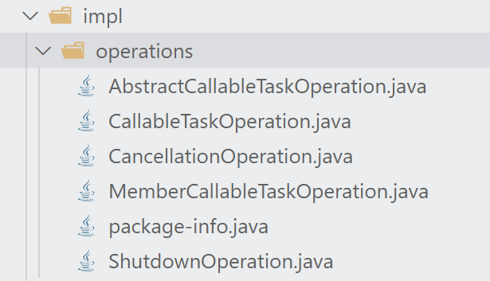
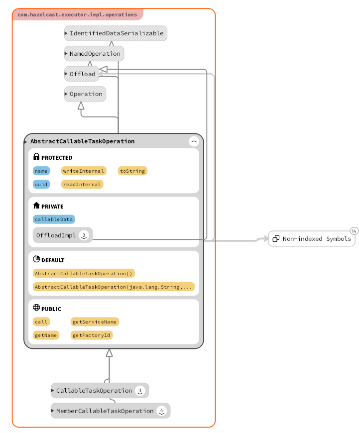
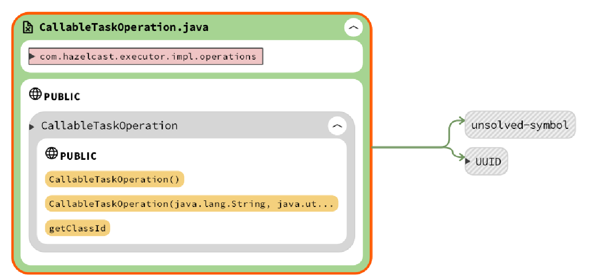
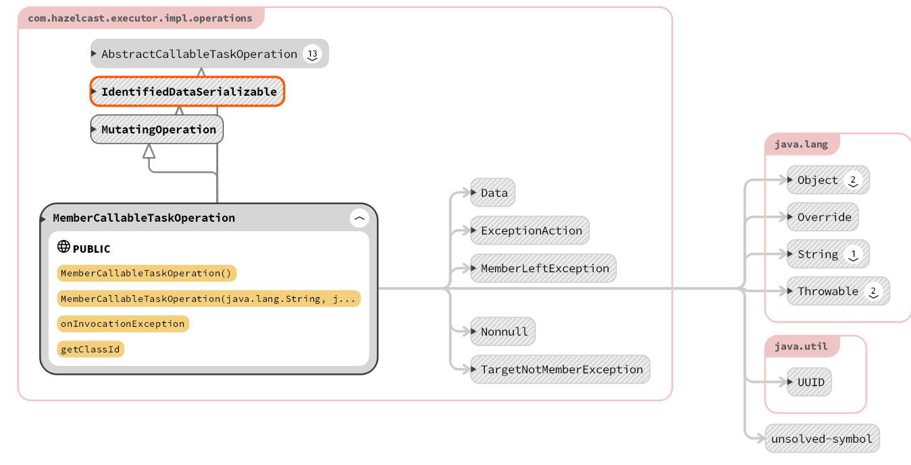
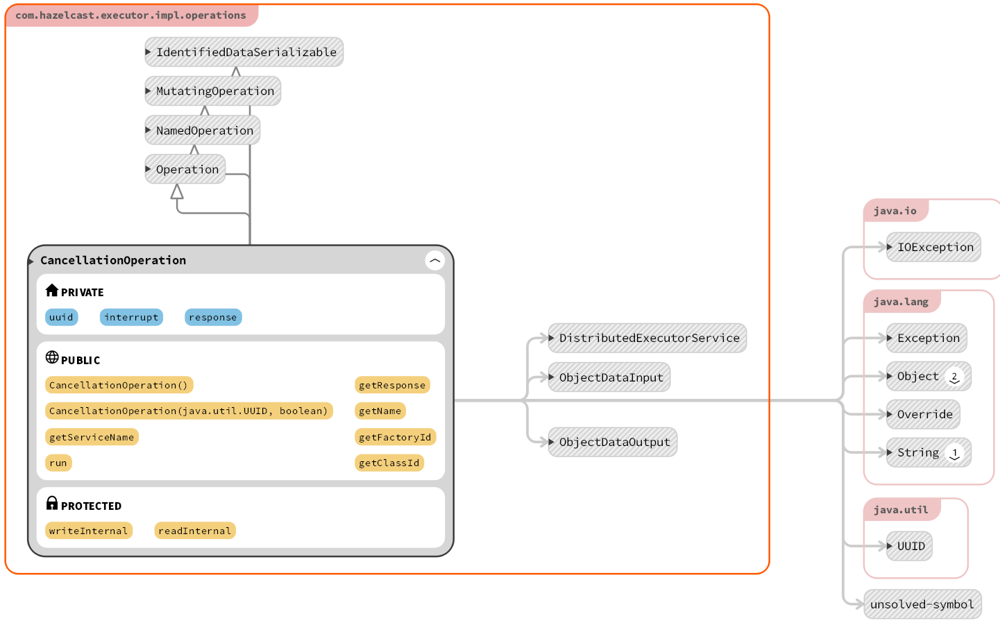
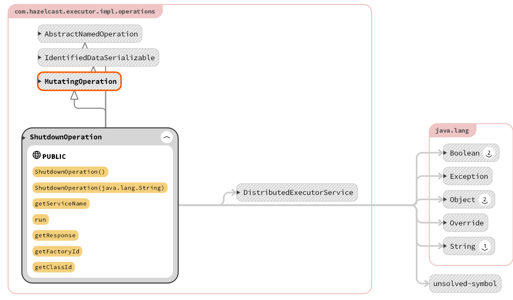

## 内部方法

**此部分主要涉及到`.hazelcast.impl.operations`文件夹中的5种方法（5个java文件）**（

（package-info显然不用考虑）

全家福如下:



### 前置知识：

**`callable 任务和runnable 任务`区别：** 

##### Callable接口

```
public interface Callable<V> {
    V call() throws Exception;
}
```

##### Runnable接口

```
public interface Runnable {
    public abstract void run();
}
```

##### 相同点

- 都是接口
- 都可以编写多线程程序
- 都采用Thread.start()启动线程

##### 不同点

- **Runnable没有返回值；Callable可以返回执行结果，是个泛型，** 和Future、FutureTask配合可以用来获取异步执行的结果

- Callable接口的call()方法允许抛出异常；Runnable的run()方法异常只能在内部消化，不能往上继续抛

  **注**：Callalble接口支持返回执行结果，需要调用FutureTask.get()得到，此方法会阻塞主进程的继续往下执行，如果不调用不会阻塞。

  

### 1. AbstractCallableTaskOperation

内部变量及方法用类图表示如下：



主要参数及函数调用参数如下:

```java
abstract class AbstractCallableTaskOperation extends Operation implements NamedOperation, IdentifiedDataSerializable {

    protected String name;
    protected UUID uuid;
    private Data callableData;
```

继承了Operation方法，实现了**命名操作和识别数据序列化 **

同时内部使用了UUID作为进程保护

主要功能：利用 `ObjectDataInput``和ObjectDataOutput`将数据序列化交互，具体实现方式会在之后的细化分析中展示。

同时实现了 `offload`功能，当负载过重的时候，可以用这个方法实现负载转移。

##### 序列化实现：

Java 提供了一种对象序列化的机制，该机制中，一个对象可以被表示为一个字节序列，该字节序列包括该对象的数据、有关对象的类型的信息和存储在对象中数据的类型。

将序列化对象写入文件之后，可以从文件中读取出来，并且对它进行反序列化，也就是说，对象的类型信息、对象的数据，还有对象中的数据类型可以用来在内存中新建对象。

再本类中的实现基本与标准序列化类似，但正如功能分析中所说，**hazelcast自身提供了序列化方法** （当然这里调用的也是自身的序列化方法），所以与java菜鸟库中提供的实例版本还不太一样

通过import下列两个包实现了序列化：

 `import com.hazelcast.internal.nio.IOUtil;` 

`import com.hazelcast.internal.util.UUIDSerializationUtil`

这两个包的主体都在下面的代码框中有所体现

读和写（序列化和反序列化）高度相似，提升代码美观性和debug效率

```java
@Override
    protected void writeInternal(ObjectDataOutput out) throws IOException {
        out.writeUTF(name);
        UUIDSerializationUtil.writeUUID(out, uuid);
        IOUtil.writeData(out, callableData);
    }

    @Override
    protected void readInternal(ObjectDataInput in) throws IOException {
        name = in.readUTF();
        uuid = UUIDSerializationUtil.readUUID(in);
        callableData = IOUtil.readData(in);
    }
```


### 2.CallableTaskOperation



继承了 `1.AbstractCallableTaskOperation` 抽象类的实现，参数基本相似：

```java
public final class CallableTaskOperation extends AbstractCallableTaskOperation
        implements IdentifiedDataSerializable, MutatingOperation {
```


### 3. MemberCallableTaskOperation

类图如下所示



同样继承了 `1.AbstractCallableTaskOperation` 抽象类的实现，但特殊的是，这里继承之后改写为对所有cluster中的member任务。

所以额外多了一个报错，当member不存在或者对象不是member时就会报错

### 4. CancellationOperation

类整体uml图为：



调用函数参数及定义变量为：

```java
public final class CancellationOperation extends Operation implements NamedOperation, MutatingOperation,
        IdentifiedDataSerializable {

    private UUID uuid;
    private boolean interrupt;
    private boolean response;
```

当该类中的同名方法被调用的时候，会产生一个`interrupt`的信号，同样通过`ObjectDataInput`和`ObjectDataOutput`将数据序列化后发送。

还定义了`response`变量，接受进程服务取消后的结果或者正常运行的返回结果。


### 5. ShutdownOperation

类图如下所示： 



没有定义自己的变量，全部调用的其他类的方法

执行主要靠下段代码：

```java
    public void run() throws Exception {
        DistributedExecutorService service = getService();
        service.shutdownExecutor(getName());
    }
```

调用Dexecutor中的关闭方法完成关闭

