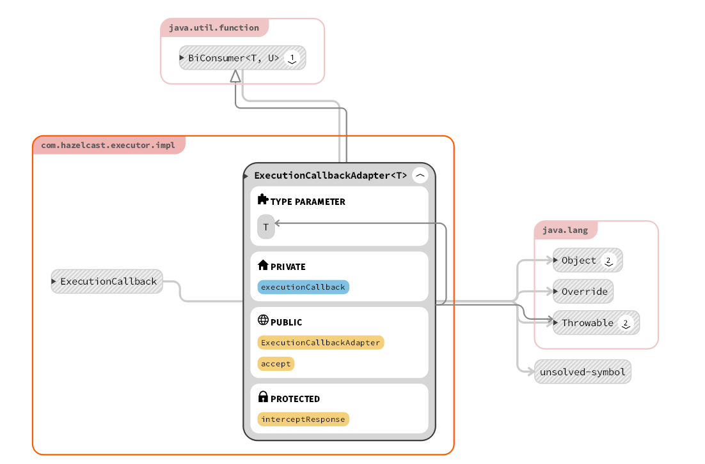

## executor整体实现

照例给出所有类全家福：（忽略某个乱入的package-info）


### 1.ExecutorDataSerializerHook

函数参数如下：

```java
public class ExecutorDataSerializerHook implements DataSerializerHook {

    public static final int F_ID = FactoryIdHelper.getFactoryId(EXECUTOR_DS_FACTORY, EXECUTOR_DS_FACTORY_ID);

    public static final int CALLABLE_TASK = 0;
    public static final int MEMBER_CALLABLE_TASK = 1;
    public static final int RUNNABLE_ADAPTER = 2;
    public static final int CANCELLATION = 3;
    public static final int SHUTDOWN = 4;
```

内部调用了工厂方法，根据上述5个序列化变量，返回对应的方法，具体代如下：

```java
    public DataSerializableFactory createFactory() {
        return new DataSerializableFactory() {
            @Override
            public IdentifiedDataSerializable create(int typeId) {
                switch (typeId) {
                    case CALLABLE_TASK:
                        return new CallableTaskOperation();
                    case MEMBER_CALLABLE_TASK:
                        return new MemberCallableTaskOperation();
                    case RUNNABLE_ADAPTER:
                        return new RunnableAdapter();
                    case CANCELLATION:
                        return new CancellationOperation();
                    case SHUTDOWN:
                        return new ShutdownOperation();
                    default:
                        return null;
                }
            }
        };
    }
```

具体分析见设计模式分析.md

### 2.ExecutionCallbackAdapterFactory


本质是对 `ExecutionCallbackAdapterFactory.done`域进行了更新，

采用了 `AtomicReferenceFieldUpdater`方法，**使得不用创建对象也可以对域进行更新，减少了创建对象的开销**

##### AtomicReferenceFieldUpdater

- ​	 一个基于反射的工具类，它能对指定类的指定的volatile引用字段进行原子更新。(注意这个字段不能是private的)

- 通过调用AtomicReferenceFieldUpdater的静态方法newUpdater就能创建它的实例，该方法要接收三个参数(后面为本函数中的实际参数）：
   	 包含该字段的对象的类     ExecutionCallbackAdapterFactory.class
    	将被更新的对象的类         Boolean.class
    	将被更新的字段的名称      "done"

- 在hazelcast类中的实现方式如下代码框内容所示：

  ```java
  private static final AtomicReferenceFieldUpdater<ExecutionCallbackAdapterFactory, Boolean> DONE =
              AtomicReferenceFieldUpdater.newUpdater(ExecutionCallbackAdapterFactory.class, Boolean.class, "done");
  ```

除了这个主要功能以外，还在主要方法 `onResponse` 中做了大量判断：

```java
    private void onResponse(Member member, Object response) {
        assertNotDone();
        assertIsMember(member);
        triggerOnResponse(member, response);
        placeResponse(member, response);
        triggerOnComplete();
    }
```

函数功能可以从函数中读出，不一一叙述，但比较特殊的是定义了两个触发函数 `teiggerOnResponse & triggerOnComplete`，其中一个的代码框架为为：

其中callback有三种形式onComplete, onSuccess, onFailure, 分别对应了直接添加之后的内容，和添加成功/失败的内容，本类中使用的是第一种，最为普适的形式。

```java
    private void triggerOnComplete() {
        if (members.size() != responses.size() || !setDone()) {
            return;
        }

        Map<Member, Object> realResponses = createHashMap(members.size());//哈希map创建一一对应的一组关系
        for (Map.Entry<Member, ValueWrapper> entry : responses.entrySet()) {
            Member key = entry.getKey();
            Object value = entry.getValue().value;
            realResponses.put(key, value);
        }//将对应的值赋给创建的对应关系
        multiExecutionCallback.onComplete(realResponses);//异步执行任务，获得callback 后添加 realResponse信息给callback
    }
```


从该类的名称中就可以发现，其内部实现了一个工厂（虽然内部可供选择的参数就只有两个），具体实现方式见设计模式分析


### 3.ExecutionCallbackAdapter



从类名称就可以看出，主要做了一个转换工作，

变更为当双参数消费函数（biconsumer）结束后进行任务，具体如下：（~~其实就是翻译的文档注释，难得一见的注释，当然要翻译过来化为己用~~）

将形如 `{@link com.hazelcast.core.ExecutionCallback}` 转化为`{ @link java.util.function.BiConsumer}`的形式，使得其可以和 ` {@link java.util.concurrent.CompletableFuture#whenComplete(BiConsumer)}`结合而被直接调用

### 4. CancellableDelegatingFuture

**对于cancellable型任务，在这个类内部实现了future任务的删除**


类内部定义了三种不同的方法，分别对应了 给的参数为 `partitionId, target,  defaultValue+partitionid`三种情况

核心功能实现方式为调用  `invokeCancelOperation`方法，同时对错误进行捕捉——报出处理，代码段如下：

```java
public boolean cancel(boolean mayInterruptIfRunning) {
        if (isDone()) {
            return false;
        }

        Future<Boolean> f = invokeCancelOperation(mayInterruptIfRunning);//核心调用
        boolean cancelSuccessful = false;
        try {
            cancelSuccessful = f.get();
        } catch (InterruptedException e) {
            Thread.currentThread().interrupt();
        } catch (Exception e) {
            throw rethrow(e);
        }//异常处理

        completeExceptionally(new CancellationException());
        return cancelSuccessful;//返回结果
    }
```

最最核心（~~命名大失败~~）的方法调用了内部方法中的取消部分，同时用了建造者模式来发送信息：

```java
    private Future<Boolean> invokeCancelOperation(boolean mayInterruptIfRunning) {
        CancellationOperation op = new CancellationOperation(uuid, mayInterruptIfRunning);//调用了内部方法里的取消操作
        OperationService opService = nodeEngine.getOperationService();
        InvocationBuilder builder;//用builder方式构造复杂进程
        if (partitionId > -1) {
            builder = opService.createInvocationBuilder(DistributedExecutorService.SERVICE_NAME, op, partitionId);
        } else {
            builder = opService.createInvocationBuilder(DistributedExecutorService.SERVICE_NAME, op, target);
        }
        builder.setTryCount(CANCEL_TRY_COUNT).setTryPauseMillis(CANCEL_TRY_PAUSE_MILLIS);
        return builder.invoke();
    }
```

### 5.RunnableAdapter

> An adapter that adapts a {@link Runnable} to become a {@link Callable}. （代码中的注释）

功能十分简单 将对象从无返回值的runnable变成有返回值的callable

继承关系如下代码框：

```java
public final class RunnableAdapter<V> implements IdentifiedDataSerializable, Callable<V>,
        HazelcastInstanceAware, PartitionAware {

    private Runnable task;
```

由于继承了很多内容，就涉及到了很多改写，其中与功能实现强相关的改写如下：

```java
    @Override
    public int getClassId() {
        return ExecutorDataSerializerHook.RUNNABLE_ADAPTER;
    }
```

在此类中的改写 在序列化转换返回id的时候返回的是RUNNABLE_ADAPTER参数，对应hook中又调用了同名方法，最终完成任务的转化。

（序列化带来一定的繁琐行提升？）

### 6 DistributedExecutorService

主体类图如下：


展示全调用关系的uml图如下：


~~看不清就对了~~，由于复杂的调用关系，展开之后基本啥都看不清，下面进行简单分析：

首先依然是参数和继承关系：

```java
public class DistributedExecutorService implements ManagedService, RemoteService,
        StatisticsAwareService<LocalExecutorStatsImpl>, SplitBrainProtectionAwareService,
        DynamicMetricsProvider {
```

要点如下：

- 在4.0版本中 hazelcast加入了 `plitBrainProtectionAwareService` 提供了数据的脑裂保护，脑裂保护（在执行操作前检查集群最小可用的member数量，避免在网络分区条件下操作在集群的多数成员成功）的部分有以下内容：
  - `execute`
  - `executeOnAllMembers`
  - `executeOnKeyOwner`
  - `executeOnMember`
  - `executeOnMembers`
  - `shutdown`
  - `shutdownNow`
  - `submit`
  - `submitToAllMembers`
  - `submitToKeyOwner`
  - `submitToMember`
  - `submitToMembers`
- 同样用原子方法实现了 `CallableProcessor.responseFlag`的更新
- 实现了 `executorConfigCache` 功能 缓存了一部分config信息，加快查找速度
- 核心程序为execute 调用了processor方法，具体分析见最后的高级设计意图分析部分

 

### 7. ExecutorServiceProxy

 由于是代理部分，类及其复杂，uml图就不给出 整理成表格形式如下：

| 修改器和类型                | 方法和描述                                                   |
| :-------------------------- | :----------------------------------------------------------- |
| `void`                      | `execute(Runnable command, MemberSelector memberSelector)`在随机选择的成员上执行任务。 |
| `void`                      | `executeOnAllMembers(Runnable command)`在所有已知群集成员上执行任务。 |
| `void`                      | `executeOnKeyOwner(Runnable command, Object key)`在指定密钥的所有者上执行任务。 |
| `void`                      | `executeOnMember(Runnable command, Member member)`在指定成员上执行任务。 |
| `void`                      | `executeOnMembers(Runnable command, Collection<Member> members)`在每个指定成员上执行任务。 |
| `void`                      | `executeOnMembers(Runnable command, MemberSelector memberSelector)`在每个选定成员上执行任务。 |
| `LocalExecutorStats`        | `getLocalExecutorStats()`返回与此执行器服务相关的本地统计信息。 |
| `<T> void`                  | `submit(Callable<T> task, ExecutionCallback<T> callback)`将任务提交给随机成员。 |
| `<T> Future<T>`             | `submit(Callable<T> task, MemberSelector memberSelector)`将任务提交给随机选择的成员，并返回表示该任务的 Future。 |
| `<T> void`                  | `submit(Callable<T> task, MemberSelector memberSelector, ExecutionCallback<T> callback)`将任务提交给随机选择的成员。 |
| `<T> void`                  | `submit(Runnable task, ExecutionCallback<T> callback)`将任务提交给随机成员。 |
| `<T> void`                  | `submit(Runnable task, MemberSelector memberSelector, ExecutionCallback<T> callback)`将任务提交给随机选择的成员。 |
| `<T> Map<Member,Future<T>>` | `submitToAllMembers(Callable<T> task)`将任务提交给所有群集成员，并返回成员-未来对的映射，表示每个成员上的任务即将完成。 |
| `<T> void`                  | `submitToAllMembers(Callable<T> task, MultiExecutionCallback callback)`将任务提交给所有群集成员。 |
| `void`                      | `submitToAllMembers(Runnable task, MultiExecutionCallback callback)`将任务提交给所有群集成员。 |
| `<T> Future<T>`             | `submitToKeyOwner(Callable<T> task, Object key)`将任务提交给指定密钥的所有者，并返回表示该任务的 Future。 |
| `<T> void`                  | `submitToKeyOwner(Callable<T> task, Object key, ExecutionCallback<T> callback)`将任务提交到指定密钥的所有者。 |
| `<T> void`                  | `submitToKeyOwner(Runnable task, Object key, ExecutionCallback<T> callback)`将任务提交给指定密钥的所有者。 |
| `<T> Future<T>`             | `submitToMember(Callable<T> task, Member member)`将任务提交到指定成员并返回表示该任务的 Future。 |
| `<T> void`                  | `submitToMember(Callable<T> task, Member member, ExecutionCallback<T> callback)`将任务提交到指定成员。 |
| `<T> void`                  | `submitToMember(Runnable task, Member member, ExecutionCallback<T> callback)`将任务提交到指定成员。 |
| `<T> Map<Member,Future<T>>` | `submitToMembers(Callable<T> task, Collection<Member> members)`向给定成员提交任务，并返回成员-未来对的返回图，表示每个成员的任务即将完成 |
| `<T> void`                  | `submitToMembers(Callable<T> task, Collection<Member> members, MultiExecutionCallback callback)`将任务提交到指定成员。 |
| `<T> Map<Member,Future<T>>` | `submitToMembers(Callable<T> task, MemberSelector memberSelector)`向选定的成员提交任务，并返回成员-未来对的映射，表示每个成员上的任务即将完成。 |
| `<T> void`                  | `submitToMembers(Callable<T> task, MemberSelector memberSelector, MultiExecutionCallback callback)`将任务提交到所选成员。 |
| `void`                      | `submitToMembers(Runnable task, Collection<Member> members, MultiExecutionCallback callback)`将任务提交到指定成员。 |
| `void`                      | `submitToMembers(Runnable task, MemberSelector memberSelector, MultiExecutionCallback callback)`将任务提交到所选成员。 |

不同的execute_on_xx 主要靠调用不同的submit_to_xx来实现

具体的实现细节会在详细设计分析中给出

